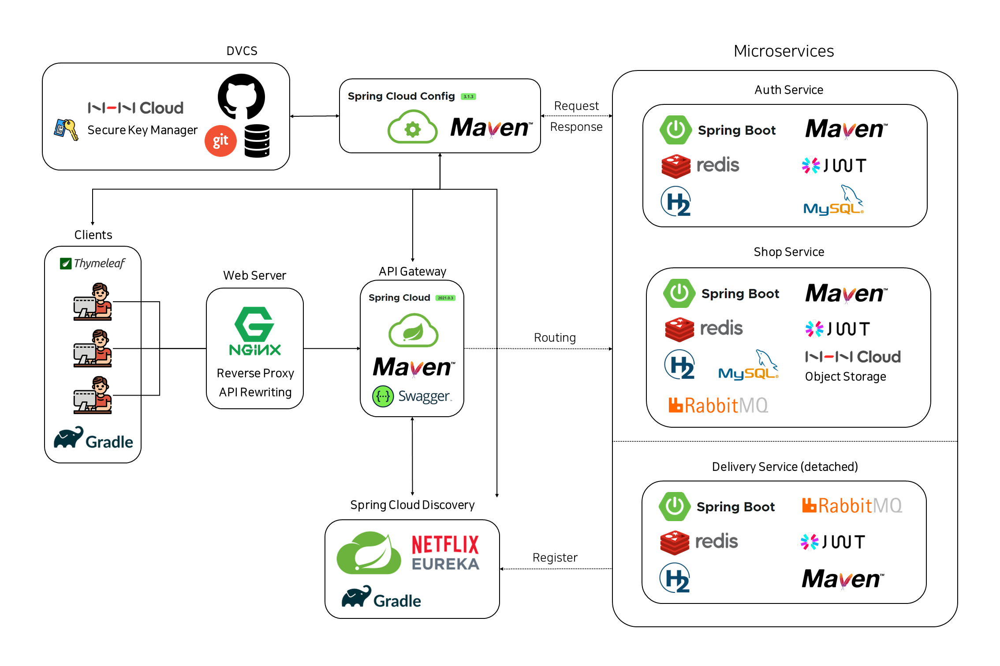
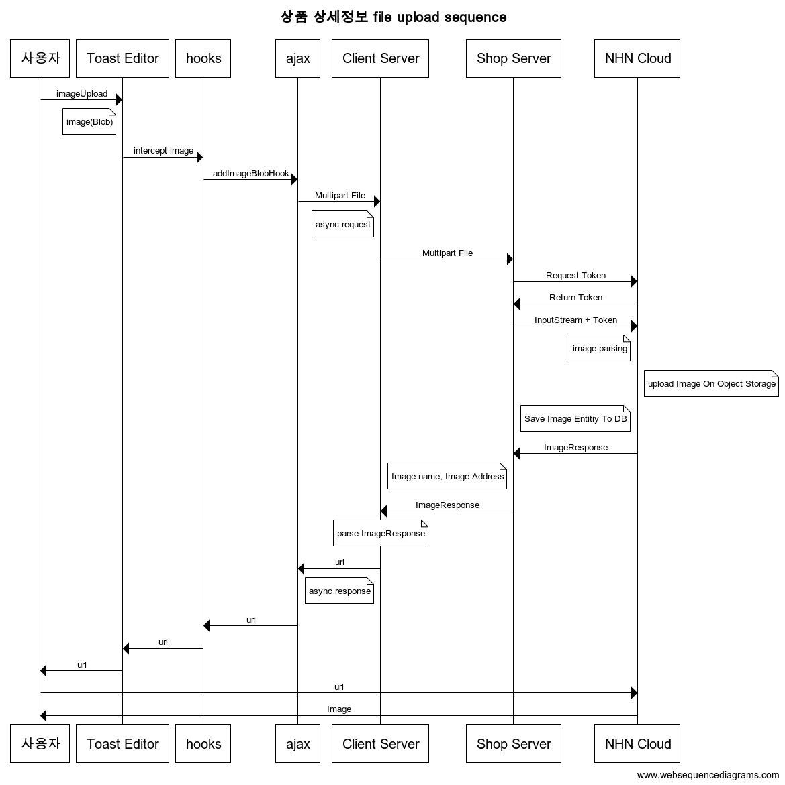

# Market GG Client

해당 프로젝트는 Market GG 의 사용자들이 이용할 페이지 정보를 Shop 서버에 요청하고, 응답 받은 데이터를 렌더링하여 UI 를 제공합니다.

# Getting Started

```
./gradle bootRun
```

# Project Architecture



# Features

## 사용자

### Dave, Duckchoon

- 작성

## GG 패스

### Copark

- GG 패스 회원의 갱신일 확인
- 회원의 GG 패스 구독 신청
- 회원의 GG 패스 해지 신청

## 카테고리

### Copark, Moomin

- 관리자의 카테고리 등록
- 관리자의 카테고리 전체 목록 조회
- 관리자의 카테고리 수정
- 관리자의 카테고리 삭제

## 라벨

### Copark

- 관리자의 라벨 등록
- 관리자의 라벨 삭제
- 관리자의 라벨 전체 목록 조회

## 상품

### Comsun

- 상품 등록 (With Panda)
- 상품 조회
- 상품 수정
- 상품 삭제

### Techinical Issue

상품 등록시 DB에 어떻게 저장할 것인가?

- MultipartForm + Toast UI Editor를 사용한 상품 등록 구현 (Panda)

editor를 사용하여 사진 첨부를 하면 Blob 형식이다. 여러 장의 사진 + 글이 섞여 있는 경우 이걸 서버에서 어떻게 처리할까? (순서, 해상도, 용량 etc…)

→ Toast Editor 기능 고도화 (ComSun) + Stroage 연동

- TUI 내의 hook 옵션을 사용하여 비동기로 Shop 서버 요청 → cloud에 사진 저장 → 해당사진의 url만 반환.
- 즉, db의 content 컬럼엔 String 형태의  text + url만 저장된다.



### Panda

- 작성

## 엘라스틱 서치

### Copark

- 상품 카테고리별 검색 결과 목록 조회
- 상품 카테고리 내 가격별 검색 결과 목록 조회
- 게시글 카테고리별 검색 결과 목록 조회
- 게시글 1:1 문의 옵션 별 검색 결과 목록 조회
    - Option. 사유, 상태
- 검색 진행 시, 내부 존재 데이터로 자동 완성 리스트 조회

## 찜

### Copark

- 상품 상세 페이지 내 찜 등록 시 해당 상품 위시리스트 이동
- 상품 상세 페이지 내 찜 삭제 시 해당 상품 위시리스트 제외
- MY GG의 찜 목록에서 찜 삭제 시 해당 상품 위시리스트 제외

### Techinical Issue

- 찜 등록/제거 시 매번 페이지를 새로 불러올것인가?
    - 찜 등록/제거 AJAX 를 통한 비동기 처리 완료

## 쿠폰

### Moomin

- 관리자의 쿠폰 목록 조회
- 관리자의 쿠폰 등록
- 관리자의 쿠폰 수정
- MY GG에서 보유 쿠폰 목록 조회
- MY GG에서 쿠폰 등록

### Panda

- 작성

## 포인트

### comsun

- 관리자의 포인트 내역 조회
- 회원의 포인트 내역 조회

## 장바구니

### Dave

- 작성

## 주문

### Corock

- 작성

## 배송

### Duckchoon

- 작성

## 후기

### Comsun

- 후기 등록
- 후기 조회
- 후기 수정
- 후기 삭제

## 고객센터

### Copark

### [공지사항]

- 관리자의 공지사항 등록
- 회원의 공지사항 전체 목록 조회
- 회원의 공지사항 상세 조회
- 관리자의 공지사항 수정
- 관리자의 공지사항 삭제

### [1:1 문의]

- 회원의 1:1 문의 등록
- 관리자의 1:1 문의 전체 조회
- 회원의 자신이 등록한 1:1 문의 조회
- 회원의 자신이 등록한 1:1 문의 삭제

### [FAQ]

- 관리자의 FAQ 등록
- 회원의 FAQ 전체 목록 조회
- 회원의 FAQ 상세 조회
- 관리자의 FAQ 수정
- 관리자의 FAQ 삭제

## Tech Stack

---

### Build Tools


### Datebases


### DevOps


### Frameworks


### Languages


### Prototyping


### Template Engine


## Libraries


### Testing Tools


### Version Control System


- Git Flow 전략 채용

  

- Main: 배포시 사용
- Develop: 개발 단계가 끝난 부분에 대해서 Merge 내용 포함
- Feature: 기능 개발 단계
- Hot-Fix: Merge 후 발생한 버그 및 수정사항 반영 시 사용

## Contributors

<a href="https://github.com/nhn-on7/marketgg-shop/graphs/contributors">

</a>


## License

Market GG is released under version 2.0 of the [Apache License](https://www.apache.org/licenses/LICENSE-2.0).leased under version 2.0 of the [Apache License](https://www.apache.org/licenses/LICENSE-2.0).